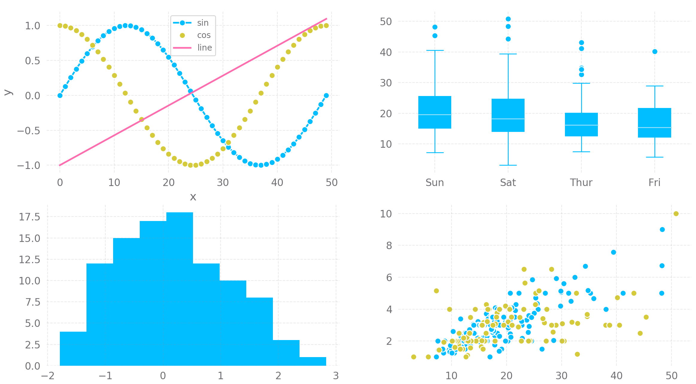

# rlibx-gui
The user-facing portion of rlibx. Unlike most of the other modules in this
project, `rlibx-gui` uses Python for the majority of its code.

## Running `rlibx-gui`
If you'd simply like to run the module, without editing it, you can run any of
the provided rlibx-gui.jar files. These files are executable JAR files that
will do a couple of things:
- Attempt to extract the Python files that are needed for execution to
  `/rlibx/python` in the local directory. If we fail, we catch an exception
  and tell the user that they're dumb or something.
- After extracting the required Python files, we ensure that we have some
  Python libraries installed. These libraries are:
  - matplotlib (`pip install matplotlib`)
  - numpy (`pip install numpy`)
- The two pip install commands that are mentioned above will be executed as
  a system process. If those dependencies are not installed, these commands
  should install them. Otherwise, they don't do anything.
- Launch the gui.py script that's been extracted from the JAR, thus actually
  and really starting the GUI program.
  
Running `rlibx-gui` requires Python 3 to be installed on the host machine.
Additionally, the executable JAR file must be in a location where the Java
process that is spawned has permission to extract files to the same directory
that it's in.

## Editing `rlibx-gui`
As soon as a stable version of the Java core of the program is finished, the
only files in this project that should be edited are the Python files. These
can be improved constantly over time. There's no solid and definitive feature
plan or roadmap for the development of the GUI portion of this library. If
you have a cool feature, tell us about it, or even go ahead and submit a pull
request. If the feature is cool, if it's good, and it works, there's no reason
not to have it. This GUI was written in Python to ensure it's easy to build and
easy to edit/modify/improve.

## Specifications
`rlibx-gui` doesn't have very many major goals, save the following.
- Draw the robot's position.
- Graph information about the robot over time, such as:
  - The robot's velocity.
  - The speed of a robot's motor.
  - A sensor value over time.
  - An encoder value over time.
- Create XML robot configurations.
  - Create them.
  - Edit them.
  - Save them.
  
### matplotlib
